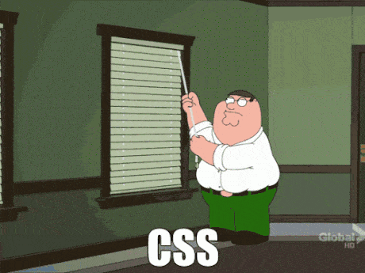

class: center, middle

# .css-evolution { perspective: inherit }

---

## AXRS (Alex Scott)

.half[
Fullstack developer at [JESI](https://jesi.io)

- Javascript/ClojureScript front end
- Java/Clojure back end
- SQL/Datomic Storage

]

.half[
Many Web (sites/apps)
- static and CMS driven
- from scratch and template

GitHub - https://github.com/axrs
]

**Shameless Plug**

We're hiring: https://jesi.io/career/

---

class: center, middle


---

.left-column[
## Why can't we...
]

.right-column[

- Reuse class names without collision
- Identify and remove unused styles and redundant overrides
- Clean/readable HTML markup
- Easily find relevant styles for components
- Only load styles currently needed by the page
- Have 100% browser compatability
]

---

class: center, middle

#### PSA: Safari is the new I.E.


---

class: center, middle



# Smells

---

.left-column[
## Smells
### Reverting Styles
]
.right-column[

Having to undo styles indicates they have been set too early

```css
/* Global style forces reverting style */
pre {
    border: 1px solid red;
    padding: 20px;
}
.tutorial pre {
    border: none;
    padding: 0;
}
```

```css
/* Targeted styling removes the need to revert */
.article pre {
    border: 1px solid red;
    padding: 20px;
}
/* Nothing to undo */
.tutorial pre { }
```

]

???
- Extra classes to remove undesired elements
  - i.e. `.no-border, .no-padding`
- Avoid global declarations where possible
- Use targeting selectors

---

.left-column[
## Smells
### Reverting Styles
### Qualified Selectors
]
.right-column[

Having qualified selectors adds unnecessary bloat

```css
/* Restricts reuse heavily tied to the HTML document */
div.article {}
ul.navigation {}
ul.navigation li.item {}
```

```css
/* Reuseable and generic */
.article {}
.navigation {}
.navigation .item {}
```

]

???
- Inhibits reuse
- Decreases reability
- Restricts structure
---

.left-column[
## Smells
### Reverting Styles
### Qualified Selectors
### Hard-coded Values
]
.right-column[

Having hard-coded or brute-forced values makes future changes tedious and prevent reactive design

```css
/* Hard coded values */
h2 {
    font-size: 24px;
    line-height: 48px;
}

.article h2 {
    font-size: 36px;
    line-height: 52px;
}
```

```css
/* Calculated and inherited values */
h2 {
    font-size: 24px;
    line-height: 2.000;
}

.article h2 {
    font-size: 36px;
}
```

]

???
- More places to change (repetition)
- Often requires visual verification

---

.left-column[
## Smells
### Reverting Styles
### Qualified Selectors
### Hard-coded Values
### Broad Selectors
]
.right-column[

Having broad or loose selectors increases property collision

```css
/* Wrecking ball application */
div {
    background-color: grey;
}
.card {
    border: 1px solid grey;
}
```
```css
/* Contextual application */
.bg-grey {
    background-color: grey;
}
.article .card {
    border: 1px solid grey;
}
.tutorial .card {
    font-family: monospaced;
}
```

]

???
- Blindly applied across your site
- Ensures reverting styles exist
- Does NOT add understanding or context

---

.left-column[
## Smells
### Reverting Styles
### Qualified Selectors
### Hard-coded Values
### Broad Selectors
### Important!s
]
.right-column[

Having `important!` is OKAY, where it makes sense.

```css
/* Brute forced */
.sidebar {
    float: none !important;
}
```

```css
/* Logical */
.error {
    color: red !important;
}
```

]

---

.left-column[
## Smells
### Reverting Styles
### Qualified Selectors
### Hard-coded Values
### Broad Selectors
### Important!s
### Floats
]
.right-column[

Floats are like the titanic. They work until you hit the iceberg


]

---

class: center, middle

# Tooling

---

.left-column[
## Tooling
#### SASS
#### LESS
#### PostCSS
#### Stylus
]

.right-column[

Start using linting and pre-processing tools to help you write re-useable and structured CSS.

```sass
/* Variables */
@width: 10px;
@height: @width + 10px;

/* Nested styles */
#header {
    width: @width;
    height: @height;
    .navigation {
        font-size: 12px;
    }
    .logo {
        width: 300px;
    }
}

/* Mixin */
.bordered {
    border-top: dotted 1px black;
    border-bottom: solid 2px black;
}

.post a {
    color: red;
    .bordered(); /* Includes the properties from .bordered */
}
```

]

---

class: center, middle

# Architecture


---

.left-column[
## Architecture
### ACSS
]

.right-column[

Atomic/Functional CSS - Single property classes

```html
<div class="bg-red fg-white">Inverted Error</div>
<div class="bg-white fg-white">Bad SEO play</div>
```

```css
.bg-red   { background-color: red; }
.bg-green { background-color: green; }
.bg-black { background-color: black; }
.bg-white { background-color: white; }
.fg-white { color: white; }
.fg-red   { color: red; }
.fg-pink  { color: pink; }
```

]

???

Atomic (also known as Functional) CSS is the approach to CSS architecture that favors small, single-purpose classes with names based on visual function.
~ [CSS-Tricks](https://css-tricks.com/lets-define-exactly-atomic-css/)

--

.right-column[

.third[
#### Ideal For

- Marketing Sites
- Content Management Systems

]

.third[
#### Pros

- Rare updates to CSS
- Rapid prototyping and implementation
- Little experience required

]

.third[
#### Cons

- Very verbose HTML
- No structural clarity
- Repetitive
- Unused styles
]

]

---

.left-column[
## Architecture
### ACSS
### OOCSS
]

.right-column[

Object-Oriented CSS - Provides separation

- of structure (invisible) and design (visible)
- of container and content
]

???
- Separate page structure from appearance
- to allow custom styling of to multiple elements without affecting structure
- i.e. A list with a header and items could be placed in both a sidebar and footer.
The only real difference is the structure of the sidebar and footer

[OOCSS](https://github.com/stubbornella/oocss/wiki)

---

.left-column[
## Architecture
### ACSS
### OOCSS
]

.right-column[

Object-Oriented CSS - Provides separation

- of structure (invisible) and design (visible)
  - structure: height, width, margin, padding, etc.
  - design: color, fonts, gradients, pointers, etc.
- of container and content
  - Container: divs, other nested elements
  - Content: Images, paragraphs, links
]

???
- Separate page structure from appearance
- to allow custom styling of to multiple elements without affecting structure
- i.e. A list with a header and items could be placed in both a sidebar and footer.
The only real difference is the structure of the sidebar and footer

[OOCSS](https://github.com/stubbornella/oocss/wiki)

---

.left-column[
## Architecture
### ACSS
### OOCSS
]

.right-column[

```html
<div class="sidebar"> <!–– Container -->
    <div class="list"> <!–– Container -->
        <h3 class="list-header"></h3> <!-- Content -->
        <ul class="list-body"></ul> <!-- Content -->
    </div>
</div>
```

```css
/* Structural */
.sidebar {
    padding: 10px;
    margin: 10px;
    width: 140px;
}

.list {
    margin: 5px;
}

/* Design */
.list-header {
    font-size: 12px;
    color: black;
}

.list-body {
    font-size: 12px;
    color: white;
}
```

]

---

.left-column[
## Architecture
### ACSS
### OOCSS
]

.right-column[

.third[
#### Ideal For

- Large Projects
- Web Applications
- Multi-Dev scenarios
]

.third[
#### Pros

- Structural clarity
- Change confidence
- Design style reuse
]

.third[
#### Cons

- Learning
- Enforcement
]

]

---

.left-column[
## Architecture
### ACSS
### OOCSS
### BEM
]

.right-column[
Block, Element, Modifier - Class Naming Convention

```html
<ul class="menu">
  <li class="menu__item">
    <a class="menu__link">
      <span class="menu__text"></span>
    </a>
  </li>
</ul>
```

```css
.menu {}
.menu__item {}
.menu__link {}
.menu__text {}
```
]
--

.right-column[

.third[
#### Ideal For

- Marketing Websites
- Web Applications

]

.third[
#### Pros

- Structural clarity
- No class collisions
- Standardized naming convention
]

.third[
#### Cons

- Heavily tied to structure
- No real class reuse
- Verbose naming
]

]

---

## Modern Web Applications

.half[
#### Issues (Web app specific)

- Only load styles currently needed by the page
  - and not out of date
- Reuse class names without collision
- Identify and remove unused styles and redundant overrides
- Browser compatability
- Clean/readable HTML markup
- Easily find relevant styles for components
- Remove a build tool
]

--

.half[
#### Solution?

CSS in Javascript (or Styled Components) with OOCSS separation rules

##### Projects:
- JS - [JSS](https://cssinjs.org)
- React - [Styled components](https://styled-components.com)
- Reagent - [re-css](https://github.com/axrs/re-css)
]

---

## Links

- https://sass-lang.com
- http://lesscss.org
- https://acss.io
- https://github.com/stubbornella/oocss/wiki
- http://getbem.com/introduction
- https://tachyons.io
